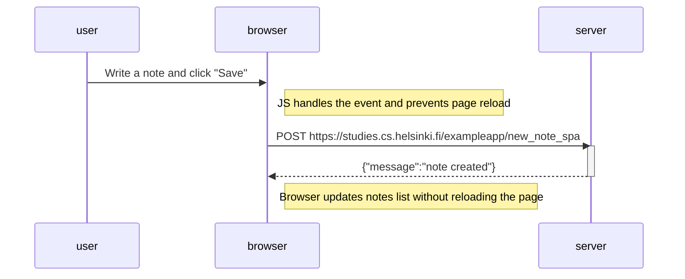

```mermaid
sequenceDiagram
    participant user
    participant browser
    participant server

    user->>browser: Write a note and click "Save"
    Note right of browser: JS handles the event and prevents page reload

    browser->>server: POST https://studies.cs.helsinki.fi/exampleapp/new_note_spa
    activate server
    server-->>browser: {"message":"note created"}
    deactivate server

    Note right of browser: Browser updates notes list without reloading the page


```